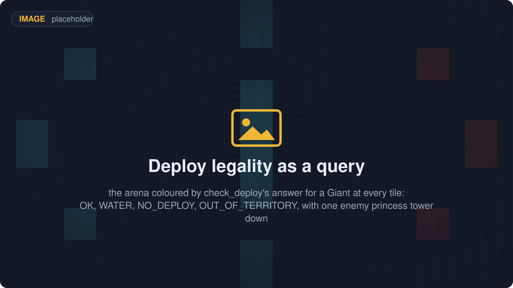
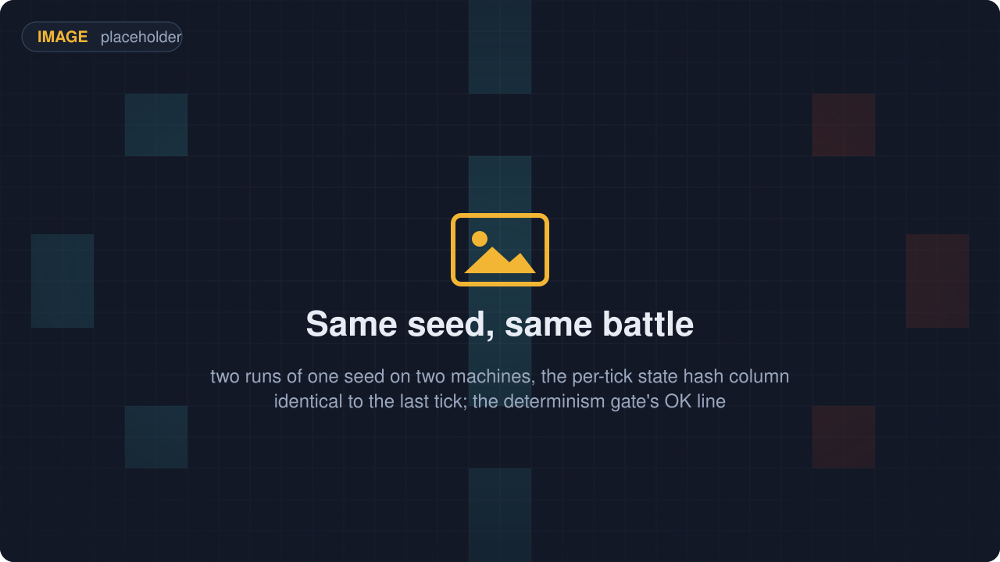
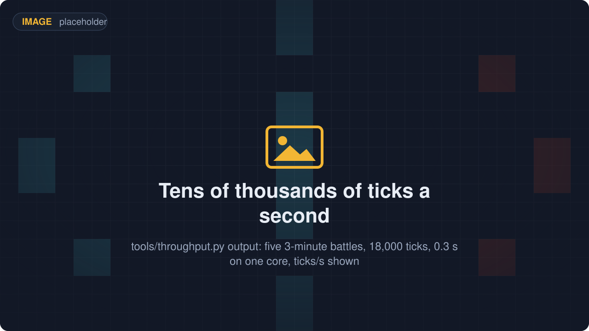
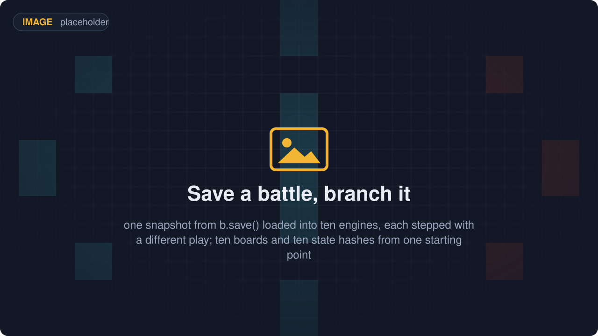

# RoyaleSim

<p align="center">
  
  <a href="docs/"></a>
  <a href="https://discord.gg/4D2BS5JBHP"></a>
  
</p>

**A Clash Royale battle engine you drive from Python. It plays the whole match: elixir, hands,
deploys, walking, targeting, fighting, spells, towers, overtime and the crowns.**

<p align="center"></p>

If you are training a bot, this is the thing your bot plays in. There is no game to run and nothing
to connect to. You install a Python module, `royalesim`, and call it.

Two things it gives you that a fan simulator usually does not.

**The same seed gives you the same battle, every time, on any machine.** The engine is Rust and it
does whole-number arithmetic only, so nothing drifts between machines. A battle that went wrong once
can be made to go wrong again.

**The movement rules were measured, not guessed.** How units choose routes, walk, and push each
other apart was measured against recordings of real battles. Every constant in the engine records
which game version it was measured on, and whether it is a guess or a measurement. The engine is not
as accurate as the real game, and the "How accurate is it?" section below gives the number and says
where it is still wrong.

It is also the engine under [RoyaleGym](https://github.com/RoyaleGym/RoyaleGym), the environment
layer bots train in. Install steps are below, under "Install".

## What it does

<table>
  <tr>
    <td width="33%" align="center"><br><b>Run a whole battle from Python</b><br><sub>One call per step. Hand in your deploys, advance N ticks of 50 ms each, read the board back as JSON.</sub></td>
    <td width="33%" align="center"><br><b>Units find their own way, the way the game does</b><br><sub>Of 744 recorded routes, 616 from real battles and 128 from an offline corpus, the engine walks 743 node for node.</sub></td>
    <td width="33%" align="center"><br><b>Crowds push each other like the real game</b><br><sub>Over 31 recorded captures, 99.24% of every unit's per-tick positions come out exact.</sub></td>
  </tr>
  <tr>
    <td width="33%" align="center"><br><b>Ask whether a card can go there</b><br><sub>Name a card and a tile. The engine answers with one of 13 codes, such as WATER or OUT_OF_TERRITORY.</sub></td>
    <td width="33%" align="center"><br><b>Same seed, same battle</b><br><sub>Whole-number arithmetic and a hash of the board every tick, so a recorded battle replays hash for hash.</sub></td>
    <td width="33%" align="center"><br><b>The engine is not the slow part</b><br><sub>Five random three-minute battles, 18,000 ticks, in 0.3 s on one core from Python (2026-09-21). Battles per hour are under "How fast is it?".</sub></td>
  </tr>
  <tr>
    <td width="33%" align="center"><br><b>144 cards, towers, spells, overtime</b><br><sub>The 15.535 client's card data, 144 cards. A match runs through overtime to the 3-crown win or the tiebreak.</sub></td>
    <td width="33%" align="center"><br><b>Save a battle, branch it</b><br><sub>A battle saves to a few kilobytes and loads back to the identical state hash, so one position forks into many.</sub></td>
    <td width="33%" align="center"><br><b>Every number says how it is known</b><br><sub>Every constant carries a status from guess to measured, and names the recording that pinned it.</sub></td>
  </tr>
</table>

## Install

You need Python 3.12 and Rust 1.80 or newer with cargo. The block below sets up all four public
repos at once, because they expect to sit side by side. If you only want the engine, the RoyaleSim
lines are the ones that matter.

```
mkdir Royale && cd Royale
git clone https://github.com/RoyaleGym/RoyaleSim.git
git clone https://github.com/RoyaleGym/RoyaleGym.git
git clone https://github.com/RoyaleGym/RoyaleViser.git
git clone https://github.com/RoyaleGym/RoyaleLearn.git
python -m venv .venv                                                    # Python 3.12
.venv\Scripts\python -m pip install maturin pytest hypothesis ruff
cd RoyaleSim && ..\.venv\Scripts\python tools\extract_arena.py && ..\.venv\Scripts\python tools\extract_cards.py --vintage 2018 && ..\.venv\Scripts\python tools\extract_cards.py --vintage 2018 --out data\derived\cards.json && ..\.venv\Scripts\python tools\extract_globals.py && cd ..   # generates RoyaleSim/data/derived/
cd RoyaleSim && ..\.venv\Scripts\maturin develop --release && cd ..     # builds the engine into the venv (~1 min, ~1.5 GB RAM)
.venv\Scripts\python -m pip install -e RoyaleGym
.venv\Scripts\python -m pip install -e RoyaleViser
.venv\Scripts\python -m pip install -e RoyaleLearn
```

For the example in the next section you need three of those lines: the venv, the `extract_*.py`
line, which generates `data/derived/`, and the `maturin develop` line, which builds the engine.
`tools/watch_battle.py` also needs RoyaleGym installed.

### About the card tables

There are two card tables, and the difference decides which tests you can run.

`extract_cards.py` defaults to the 15.535 card table, which needs the client's own asset pack
(`data/raw/cr-15.535.29/`). That pack is not redistributed, so a fresh clone does not have it.
`--vintage 2018` builds the card table from the tracked 2018 files instead, which is what the two
`extract_cards.py` runs above do. One writes `data/derived/cards-2018.json`, which
`tests/stacked_tie.rs` loads by that name. The other writes the same table over
`data/derived/cards.json`, which is what the engine loads.

A 2018-only checkout runs the engine, the example below and the Python suite. It is not gate-green.
Three checks want the 15.535 table specifically: `tests/levels.rs` scores the level ladder against
recorded `max_hp`, `tests/jump16402.rs` wants the jump blocks of the Hog Rider, Prince and Dark
Prince, and `tools/check_data.py`'s live-level rows go vacuous without them. Those need the 15.535
pack and `extract_cards.py` with no `--vintage`.

One build note. The engine compiles `data/calibration.json` and `data/derived/arena.json` in, so
after editing either one, build again. RoyaleGym refuses a stale build.

## Try it

After the install above, this runs as is. A Giant is played for Blue (team 0, the bottom half of
the arena) and left alone for 24 seconds of game time. Nobody tells it where to walk.

```python
import json, royalesim

deck = ["Giant", "Knight", "Archers", "Musketeer", "Fireball", "Arrows", "Minions", "Goblins"]
b = royalesim.Battle(card_names=deck, slot_of_k=[[0, 1, 2], [0, 1, 2]])
b.reset(seed=1, decks=[list(range(8))] * 2, shuffle=0, start_tick=0,
        elixir_milli=[10_000, 10_000], tower_hp=None, spawns=[])

T = royalesim.SUBTILE                   # positions are in subtiles: 18000 to one arena tile
b.step([(0, 0, 5 * T, 10 * T)], 0)      # Blue plays hand slot 0 (the Giant) on tile (5, 10)
for _ in range(6):
    b.step([], 80)                      # 80 ticks = four seconds of game time, one call
    s = json.loads(bytes(b.state_json()))
    giant = next(e for e in s["entities"] if e[3] == 0)
    print(f"t={s['tick']}  giant at ({giant[5] / T:.2f}, {giant[6] / T:.2f})"
          f"  hp={giant[7]}  red left tower hp={s['players'][1]['tower_hp'][1]}")
```

```
t=80  giant at (4.34, 12.56)  hp=3968  red left tower hp=3052
t=160  giant at (3.86, 16.15)  hp=3968  red left tower hp=3052
t=240  giant at (3.77, 19.82)  hp=3532  red left tower hp=3052
t=320  giant at (3.77, 22.57)  hp=2987  red left tower hp=2799
t=400  giant at (3.77, 22.57)  hp=2442  red left tower hp=2293
t=480  giant at (3.77, 22.57)  hp=1897  red left tower hp=1534
```

Nobody steered the Giant. It picked its own route on the measured route-finder. It slid left onto
the bridge column, crossed the river around t=160, walked into princess-tower fire, stopped within
its own reach of the tower at t=320 and started hitting it. Run it again with the same seed and the
numbers are the same.

The positions and the timing above will be the same on your machine. The hitpoints may not. Card
levels come from the card table you built, so the two right-hand columns move between the 15.535
table and the `--vintage 2018` one. The run above used 15.535. If your hitpoints differ and the
route does not, nothing is wrong.

To watch a battle instead of reading numbers, run `python tools\watch_battle.py --open`. It plays a
random three-minute match, runs five checks on it and opens a self-contained HTML page that you can
scrub tick by tick. The five checks are: it replays hash for hash, both sides deployed and fought,
the arena matches, ground units stayed mostly dry, and the page holds every frame. The whole thing
takes under two seconds end to end (1.4 s on 2026-09-21).

## How fast is it?

**About 65,000 battles per hour on a laptop.**

That laptop is a 4-core i7 with 8 GB of RAM, and other programs were running at the time.
Battles per hour, by how many worker processes you run:

| workers | battles / hour |
|---|---|
| 1 | 16,100 |
| 2 | 31,100 |
| 4 | 49,300 |
| 6 | 65,200 |

Each worker is just a Python process with its own copy of the engine. There is nothing else in
the loop: no phone, no copy of the game, no virtual machine, nothing to wait for over a network.
So if your computer has more cores you get more battles. A desktop with 16 cores will go several
times faster than the numbers above.

What that means in practice: a bot that needs a million battles to get good is a fifteen-hour
run, not a fortnight. You can start one before bed and read the result at breakfast.

## How accurate is it?

Good, not perfect, and measured. Here is the honest number.

We record real matches, replay them in the engine, and compare where every unit was on every tick:

| how often the engine agrees | counting towers | towers left out |
|---|---|---|
| a unit is within a quarter of a tile of where it really was | 83.9% | 49.4% |
| a unit's hitpoints are exactly right | 83.3% | 81.4% |

The right-hand column is the one to look at. Towers do not move and there are six of them in
every battle, so counting them flatters the result.

Single units are already close. A Knight is within a quarter tile 82.5% of the time and walks the
exact same path 74.9% of the time. Swarms are where the gap is: Goblins 42.5%, Skeletons 43.9%.

**Those numbers are today's, not the target.** The target is that a swarm fight does not diverge
either. We know where the gap comes from, because the same run that produces the table above also
reports what went wrong first in every battle:

| cause of the first divergence | share of the error |
|---|---|
| where a spawner or a multi-unit card puts its units | 32.5% |
| how units push each other apart on contact | 31.0% |
| when a unit dies | 21.9% |
| attack timing | 13.9% |
| walking | 0.4% |

Two causes are 63% of what is left, and both are being worked on. 25 of the 67 battles in the
corpus never diverge at all, though most of those are short. A single unit walking on its own is
close to solved, which is why walking is the smallest row in the table: a Knight is within a
quarter tile 82.5% of the time. Expect these numbers to keep moving.

So: this engine is not as accurate as running the real game, which is correct by definition. It is
faster, it runs anywhere, it needs no game files, and it tells you exactly how wrong it is and where.
Check the table before you rely on a specific interaction, and check it again in a month.

## Check it yourself

Speed, from a clone:

```
cd RoyaleGym && ..\.venv\Scripts\python -m pytest -q tests/test_rust_engine.py -k throughput -s
```

That prints a line of rates, one of them `engine ticks/s`. That number is also roughly battles per
hour for one worker, which is a happy accident of the arithmetic: a three-minute battle is 3,600
ticks and an hour is 3,600 seconds. On the laptop above it printed 20,219 while five other jobs
were running, so do not be surprised if your number is nowhere near the table. The table was
measured on an otherwise ordinary evening, and machine load moves it by a third either way.

Accuracy is measured against recorded real matches. Those recordings are private, so you cannot
re-run that one yourself. The method, the full table, the per-card breakdown and the exact commands
are in [docs/replay-parity.md](docs/replay-parity.md), and everything the number is built from is
described there rather than summarised.

Every figure in these two sections came from one of those two places. If you re-run the speed
test and get something different, your machine is different from ours, and we would like to know.

## With the rest of the stack

<p align="center"></p>

RoyaleSim is the bottom of the stack. It knows nothing about rewards, observations or training. If
you are writing a bot, you will spend your time in RoyaleGym and RoyaleLearn, and this repo will
just be the thing underneath that plays the match.

| Repo | What it is | What it is to RoyaleSim |
|---|---|---|
| **RoyaleSim** (this repo) | the battle engine, in Rust: whole-number arithmetic, same seed same battle, movement rules measured against recordings of real battles | the engine |
| [RoyaleGym](https://github.com/RoyaleGym/RoyaleGym) | the environment API: observations, actions, rewards; Gymnasium, PettingZoo and self-play envs | wraps `royalesim` as `RustEngine`, reads this repo's `data/` for the arena and cards, and its test suite drives the engine from the outside |
| [RoyaleLearn](https://github.com/RoyaleGym/RoyaleLearn) | the training harness: self-play rollouts, PPO, a ladder of frozen opponents, checkpoints | reaches the engine only through RoyaleGym |
| [RoyaleViser](https://github.com/RoyaleGym/RoyaleViser) | the viewer: recordings, engine traces and running environments in its own window | plays engine traces (a trace is the engine's own per-tick record of a battle) and live streams; the still in the first tile is one of its screenshots |
| RoyaleLive | private. The client instrument that records ground-truth traces from real battles. | its recordings are the evidence the engine's constants are measured against |

What comes in: Supercell's card and arena tables under `data/raw/`, which `tools/extract_*.py` turn
into `data/derived/`. And recordings of real battles, which the constants were measured against.
Those recordings are not distributed, and the tests that need them skip and say so.

What goes out: the `royalesim` module, one JSON state per step, engine traces that RoyaleGym records
and RoyaleViser plays, and the `data/` folder every sibling reads. RoyaleGym finds it at
`../RoyaleSim/data`, or wherever `ROYALESIM_DATA_DIR` points.

## Status (2026-09-21)

Working:

- The full match loop on the 15.535 client's own card data (144 cards, 2 towers, 334 units), with
  card levels and the tower ladder measured on 2026 recordings: elixir, deploys, formations for
  multi-unit cards, fighting, Fireball, Arrows, Zap, The Log and Goblin Barrel, king activation,
  double elixir, 60 s overtime, the 3-crown win and the tiebreak.
- Mechanics measured against recordings of the game, and switchable in the constants file: route
  choice (743 of 744 routes node for node), how units push each other (99.24% of per-tick positions
  exact over 31 captures), reach and the attack cycle, the charged hit, knockback, the river hop,
  spawner timing and death spawns, hiding buildings, the lifetime drain of buildings, status effects
  (rage, slow, freeze, heal and damage over time) and the order things happen within a tick.
- Same seed same battle, snapshots, seat symmetry (Red is Blue turned 180 degrees, checked every
  tick) and the deploy-legality query.

Not modelled yet, in plain words:

- Only the 18 cards in `thin_slice` (`data/derived/cards.json`) are checked against recordings. The
  rest of the 144 carry data that no test covers yet.
- Dash and morph, air units beyond flying straight at their target, evolutions, champions' abilities
  and tower troops.
- Two known collision defects. A unit can sit inside a building's footprint for up to 47 ticks,
  almost always right after a multi-unit spawn. A unit overlapping several obstacles gets the
  push-outs summed instead of one chosen.
- One recorded route in 744 comes out different. Both routes cost the same, and which one the game
  picks is the open question.

Tests:

```
cd RoyaleSim\crates\royalesim && cargo test --release     # 338 test functions, 3 of them #[ignore]d
cd RoyaleSim && ..\.venv\Scripts\python -m pytest -q       # 108 collected
```

The cargo run above assumes the 15.535 card table, as described under Install. On a 2018-only
checkout `levels.rs` and `jump16402.rs` go red for want of it. RoyaleGym's suite drives the engine
from the outside and must stay green too.

Read next: [`docs/architecture.md`](docs/architecture.md) (how the engine is built),
[`docs/pathfinding.md`](docs/pathfinding.md) (the measured routes and contact law, with the
evidence), [`docs/mechanics.md`](docs/mechanics.md) (what is modelled, what is not, the defects),
[`docs/contributing.md`](docs/contributing.md) (the build loop and every gate),
[`docs/calibration.md`](docs/calibration.md) (the constants file and its status vocabulary).
[`docs/README.md`](docs/README.md) indexes the rest.

## Community

Engine questions, calibration evidence and pathfinding work happen in the project's Discord:
[**https://discord.gg/4D2BS5JBHP**](https://discord.gg/4D2BS5JBHP)

Issues and pull requests on this repo are welcome too.
