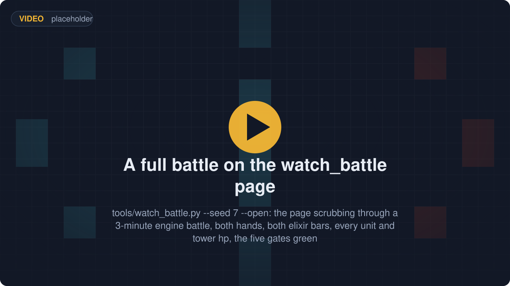

# RoyaleSim

**A Clash Royale battle engine you step from Python, with its movement rules measured off recordings
of the real game.** For people who train bots and want a fast, exact, deterministic match to train
them in.

<p align="center"></p>

RoyaleSim plays a whole Clash Royale match without the game: elixir, hands, deploys, walking,
targeting, fighting, spells, towers, overtime and the crowns. It is written in Rust with integer
arithmetic only, so the same seed gives the same battle run after run on any machine, and it plays
a three-minute match in well under a second. It installs as one Python module, `royalesim`, and is
the engine under [RoyaleGym](https://github.com/RoyaleGym/RoyaleGym), the environment layer bots
train in. What separates it from a fan simulator is where its rules come from: how units choose
routes, walk and push each other was measured against recordings of real battles, and every
constant records which game version it was measured on.

## What it does

<table>
  <tr>
    <td width="33%" align="center"><br><b>Run a whole battle from Python</b><br><sub>One call per step: hand in your deploys, advance N ticks of 50 ms each, read the board back as JSON.</sub></td>
    <td width="33%" align="center"><br><b>Routes measured off real battles</b><br><sub>Of 744 recorded routes — 616 from real battles and 128 from an offline corpus — the engine reproduces 743 node for node.</sub></td>
    <td width="33%" align="center"><br><b>Crowds that push like the real game</b><br><sub>Over 31 recorded battles, 99.24% of every unit's per-tick positions come out exact.</sub></td>
  </tr>
  <tr>
    <td width="33%" align="center"><br><b>Deploy legality as a query</b><br><sub>Ask if a card may go on a tile; the engine answers with one of 13 codes, such as WATER or OUT_OF_TERRITORY.</sub></td>
    <td width="33%" align="center"><br><b>Same seed, same battle</b><br><sub>Integer arithmetic only and a state hash every tick, so a recorded battle re-simulates hash for hash.</sub></td>
    <td width="33%" align="center"><br><b>Tens of thousands of ticks a second</b><br><sub>Five random three-minute battles, 18,000 ticks, in 0.3 s on one core from Python (2026-09-21).</sub></td>
  </tr>
  <tr>
    <td width="33%" align="center"><br><b>144 cards, towers, spells, overtime</b><br><sub>The 15.535 client's card data, 144 cards; a match runs through overtime to the 3-crown win or the tiebreak.</sub></td>
    <td width="33%" align="center"><br><b>Save a battle, branch it</b><br><sub>A battle saves to a few kilobytes and loads back to the identical state hash, so one position forks into many.</sub></td>
    <td width="33%" align="center"><br><b>Every number says how it is known</b><br><sub>Every constant carries a status from guess to measured and names the recording that pinned it.</sub></td>
  </tr>
</table>

## Try it

After the install below, this runs as is. A Giant is played for Blue (team 0, the bottom half of
the arena) and left alone for 24 seconds of game time; nobody tells it where to walk.

```python
import json, royalesim

deck = ["Giant", "Knight", "Archers", "Musketeer", "Fireball", "Arrows", "Minions", "Goblins"]
b = royalesim.Battle(card_names=deck, slot_of_k=[[0, 1, 2], [0, 1, 2]])
b.reset(seed=1, decks=[list(range(8))] * 2, shuffle=0, start_tick=0,
        elixir_milli=[10_000, 10_000], tower_hp=None, spawns=[])

T = royalesim.SUBTILE                   # positions are in subtiles: 18000 to one arena tile
b.step([(0, 0, 5 * T, 10 * T)], 0)      # Blue plays hand slot 0 (the Giant) on tile (5, 10)
for _ in range(6):
    b.step([], 80)                      # 80 ticks = four seconds of game time, one call
    s = json.loads(bytes(b.state_json()))
    giant = next(e for e in s["entities"] if e[3] == 0)
    print(f"t={s['tick']}  giant at ({giant[5] / T:.2f}, {giant[6] / T:.2f})"
          f"  hp={giant[7]}  red left tower hp={s['players'][1]['tower_hp'][1]}")
```

```
t=80  giant at (4.34, 12.56)  hp=3344  red left tower hp=2968
t=160  giant at (3.86, 16.15)  hp=3344  red left tower hp=2968
t=240  giant at (3.77, 19.82)  hp=3026  red left tower hp=2968
t=320  giant at (3.76, 23.30)  hp=2390  red left tower hp=2968
t=400  giant at (3.76, 23.30)  hp=1860  red left tower hp=2335
t=480  giant at (3.76, 23.30)  hp=1330  red left tower hp=1913
```

The Giant picked its own route on the measured route-finder: it slid left onto the bridge column,
crossed the river around t=160, walked into princess-tower fire, stopped within its own reach of
the tower at t=320 and started hitting it. Run it again with the same seed and the numbers are the same.

For a battle you can watch, `python tools\watch_battle.py --open` plays a random three-minute match,
runs five checks on it (it re-simulates hash for hash, both sides deployed and fought, the arena
matches, ground units stayed mostly dry, the page holds every frame) and opens a self-contained
HTML page that scrubs it tick by tick. Under two seconds end to end (1.4 s on 2026-09-21).

## With the rest of the stack

<p align="center"></p>

RoyaleSim is the bottom of the stack. It knows nothing about rewards, observations or training.

| Repo | What it is | What it is to RoyaleSim |
|---|---|---|
| **RoyaleSim** (this repo) | the battle engine: deterministic, integer-only Rust, its movement rules measured against recordings of real battles | the engine |
| [RoyaleGym](https://github.com/RoyaleGym/RoyaleGym) | the environment API: observations, actions, rewards; Gymnasium, PettingZoo and self-play envs | wraps `royalesim` as `RustEngine`, reads this repo's `data/` for the arena and cards, and its test suite drives the engine from the outside |
| [RoyaleLearn](https://github.com/RoyaleGym/RoyaleLearn) | the training harness: self-play rollouts, PPO, a ladder of frozen opponents, checkpoints | reaches the engine only through RoyaleGym |
| [RoyaleViser](https://github.com/RoyaleGym/RoyaleViser) | the viewer: recordings, engine traces and running environments in its own window | plays engine traces (a trace is the engine's own per-tick record of a battle) and live streams; the still in the first tile is one of its screenshots |
| RoyaleLive | the client instrument that records ground-truth traces from the real game | its recordings are the evidence the engine's constants are measured against |

What flows in: Supercell's card and arena tables under `data/raw/`, which `tools/extract_*.py` turn
into `data/derived/`; and recordings of real battles, which the constants were measured against
and which are not distributed (the tests that need them skip and say so). What flows out: the
`royalesim` module, one JSON state per step, engine traces that RoyaleGym records and RoyaleViser
plays, and the `data/` folder every sibling reads (RoyaleGym finds it at `../RoyaleSim/data`, or
wherever `ROYALESIM_DATA_DIR` points).

```
mkdir Royale && cd Royale
git clone https://github.com/RoyaleGym/RoyaleSim.git
git clone https://github.com/RoyaleGym/RoyaleGym.git
git clone https://github.com/RoyaleGym/RoyaleViser.git
git clone https://github.com/RoyaleGym/RoyaleLearn.git
python -m venv .venv                                                    # Python 3.12
.venv\Scripts\python -m pip install maturin pytest hypothesis ruff
cd RoyaleSim && ..\.venv\Scripts\python tools\extract_arena.py && ..\.venv\Scripts\python tools\extract_cards.py --vintage 2018 --out data\derived\cards.json && ..\.venv\Scripts\python tools\extract_globals.py && cd ..   # generates RoyaleSim/data/derived/
cd RoyaleSim && ..\.venv\Scripts\maturin develop --release && cd ..     # builds the engine into the venv (~1 min, ~1.5 GB RAM)
.venv\Scripts\python -m pip install -e RoyaleGym
.venv\Scripts\python -m pip install -e RoyaleViser
.venv\Scripts\python -m pip install -e RoyaleLearn
```

`extract_cards.py` defaults to the 15.535 card table, which needs the client's own asset pack
(`data/raw/cr-15.535.29/`, not redistributed); `--vintage 2018` builds the card table from the
tracked 2018 files instead, which is what the line above does.

For the example above you need the venv, the `extract_*.py` line (it generates `data/derived/`)
and the `maturin develop` line (Rust 1.80+ with cargo); `tools/watch_battle.py` also needs
RoyaleGym installed. The engine compiles `data/calibration.json` and `data/derived/arena.json`
in, so after editing either, build again; RoyaleGym refuses a stale build.

## Status (2026-09-21)

Working:

- The full match loop on the 15.535 client's own card data (144 cards, 2 towers, 334 units), with
  card levels and the tower ladder measured on 2026 recordings: elixir, deploys, formations for
  multi-unit cards, fighting, Fireball, Arrows, Zap, The Log and Goblin Barrel, king activation,
  double elixir, 60 s overtime, the 3-crown win and the tiebreak.
- Mechanics measured against recordings of the game and switchable in the constants file: route
  choice (743 of 744 routes node for node), how units push each other (99.24% of per-tick positions
  exact over 31 battles), reach and the attack cycle, the charged hit, knockback, the river hop,
  spawner timing and death spawns, hiding buildings, the lifetime drain of buildings, status effects
  (rage, slow, freeze, heal and damage over time) and the order things happen within a tick.
- Determinism, snapshots, seat symmetry (Red is Blue turned 180 degrees, checked every tick) and
  the deploy-legality query.

Not modelled yet, in plain words:

- Only the 18 cards in `thin_slice` (`data/derived/cards.json`) are checked against recordings; the
  rest of the 144 carry data no test covers yet.
- Dash and morph, air units beyond flying straight at their target, evolutions, champions'
  abilities and tower troops.
- Two known collision defects: a unit can sit inside a building's footprint for up to 47 ticks,
  almost always right after a multi-unit spawn. A unit overlapping several obstacles gets the
  push-outs summed instead of one chosen.
- One recorded route in 744 comes out different: both routes cost the same and which one the game
  picks is the open question.

Tests:

```
cd RoyaleSim\crates\royalesim && cargo test --release     # 338 test functions, 3 of them #[ignore]d
cd RoyaleSim && ..\.venv\Scripts\python -m pytest -q       # 101 collected
```

RoyaleGym's suite drives the engine from the outside and must stay green too.

Read next: [`docs/architecture.md`](docs/architecture.md) (how the engine is built),
[`docs/pathfinding.md`](docs/pathfinding.md) (the measured routes and contact law, with the
evidence), [`docs/mechanics.md`](docs/mechanics.md) (what is modelled, what is not, the defects),
[`docs/contributing.md`](docs/contributing.md) (the build loop and every gate),
[`docs/calibration.md`](docs/calibration.md) (the constants file and its status vocabulary).
[`docs/README.md`](docs/README.md) indexes the rest.

## Community

Engine questions, calibration evidence and pathfinding work happen in the project's Discord:
[**https://discord.gg/4D2BS5JBHP**](https://discord.gg/4D2BS5JBHP)

Issues and pull requests on this repo are welcome too.
