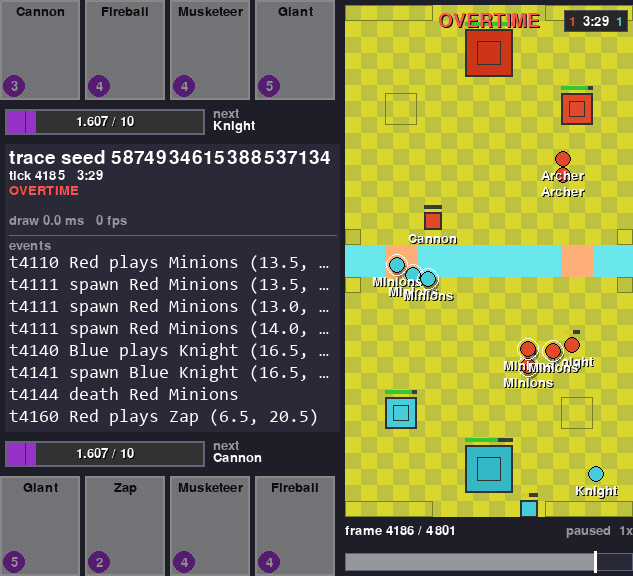
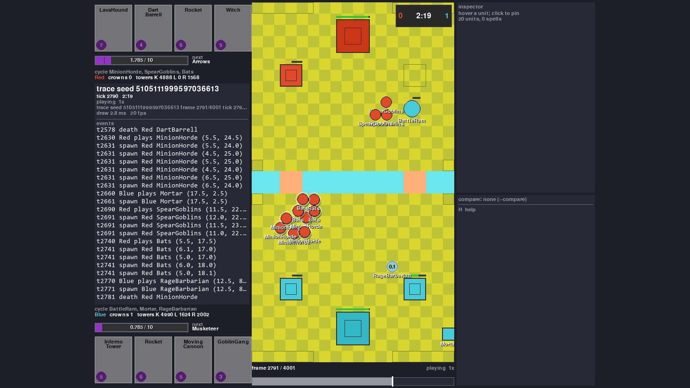
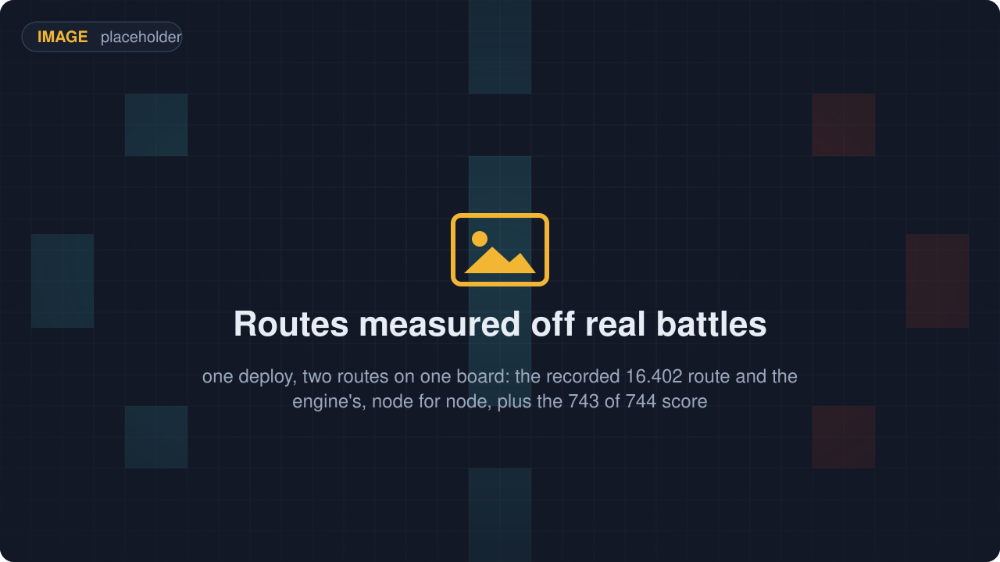
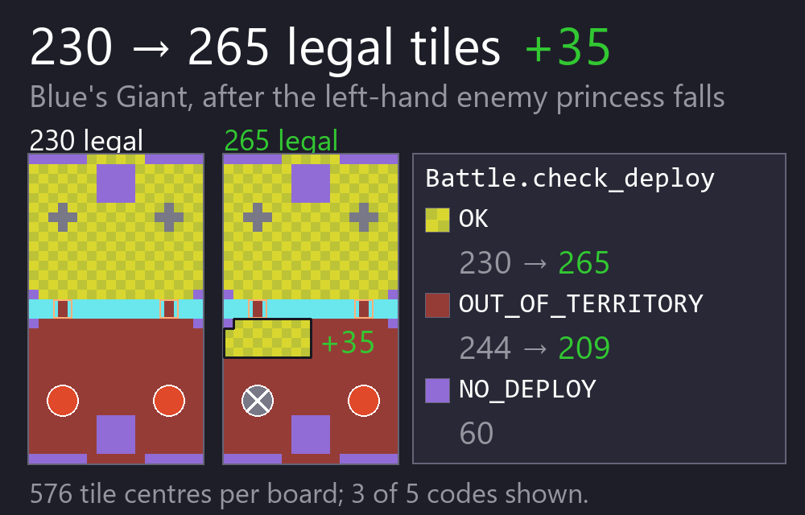
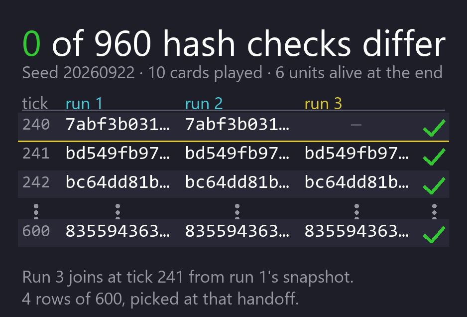
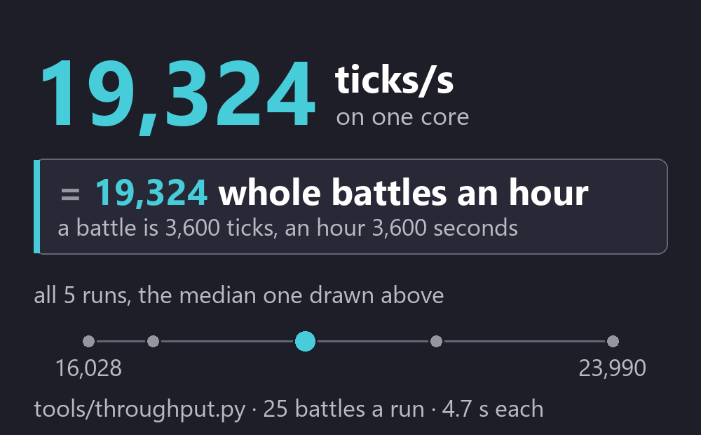
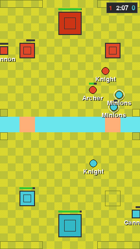
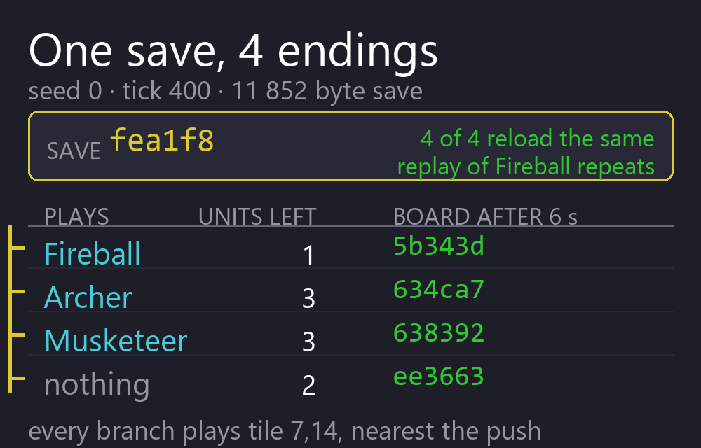
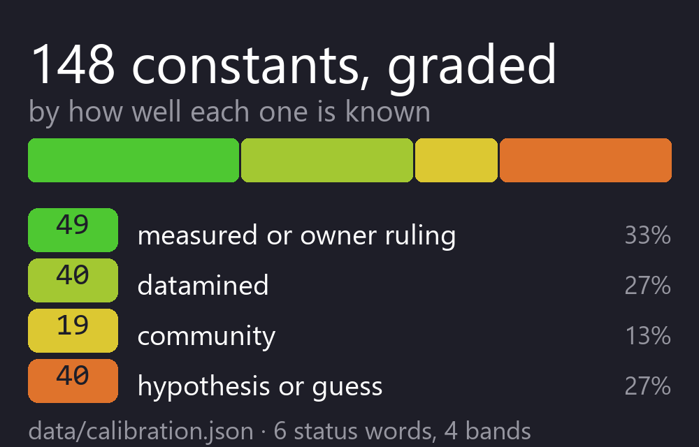
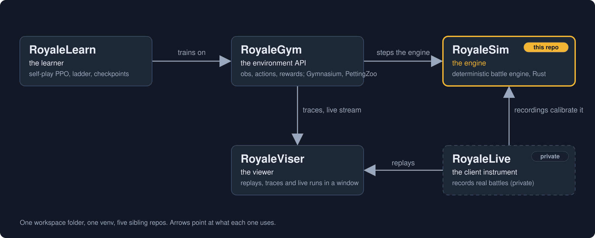

# RoyaleSim

<p align="center">
  
  <a href="docs/"></a>
  <a href="https://discord.gg/4D2BS5JBHP"></a>
  
</p>

<p align="center">
  
  
  
  
  
</p>

**A Clash Royale battle engine you drive from Python. It plays the whole match: elixir, hands,
deploys, walking, targeting, fighting, spells, towers, overtime and the crowns.**

<p align="center"></p>

If you are training a bot, this is the thing your bot plays in. There is no game to run and nothing
to connect to. You install a Python module, `royalesim`, and call it.

Two things it gives you that a fan simulator usually does not.

**The same seed gives you the same battle, every time, on any machine.** The engine is Rust and it
does whole-number arithmetic only, so nothing drifts between machines. A battle that went wrong once
can be made to go wrong again.

**The movement rules were measured, not guessed.** How units choose routes, walk, and push each
other apart was measured against recordings of real battles. Every constant in the engine records
which game version it was measured on, and whether it is a guess or a measurement. The engine is not
as accurate as the real game, and the "How accurate is it?" section below gives the number and says
where it is still wrong.

It is also the engine under [RoyaleGym](https://github.com/RoyaleGym/RoyaleGym), the environment
layer bots train in. Install steps are below, under "Install".

## What it does

<table>
  <tr>
    <td width="33%" align="center"><br><b>Run a whole battle from Python</b><br><sub>One call per step. Hand in your deploys, advance N ticks of 50 ms each, read the board back as JSON.</sub></td>
    <td width="33%" align="center"><br><b>Units find their own way, the way the game does</b><br><sub>Of 744 recorded routes, 616 from real battles and 128 from an offline corpus, the engine walks 743 node for node.</sub></td>
    <td width="33%" align="center"><br><b>Crowds push each other like the real game</b><br><sub>Over 31 recorded captures, 99.24% of every unit's per-tick positions come out exact.</sub></td>
  </tr>
  <tr>
    <td width="33%" align="center"><br><b>Ask whether a card can go there</b><br><sub>Name a card and a tile. The engine answers with one of 13 codes, such as WATER or OUT_OF_TERRITORY. A Giant has 230 of 576 tiles at the start, and 35 more once a tower falls.</sub></td>
    <td width="33%" align="center"><br><b>Same seed, same battle</b><br><sub>Whole-number arithmetic and a hash of the board every tick. Two runs of one seed, plus a third resumed from a snapshot: 960 checks, none differ.</sub></td>
    <td width="33%" align="center"><br><b>The engine is not the slow part</b><br><sub>A three-minute battle is 3,600 ticks and an hour is 3,600 seconds, so the tool's ticks per second is also battles per hour on one core. Yours will differ with load.</sub></td>
  </tr>
  <tr>
    <td width="33%" align="center"><br><b>Cards, towers, spells, overtime</b><br><sub>The engine loads 102 cards, refuses 44 with a reason for each, and treats 12 more as summon-only, counted by the loader itself on a clean runner (RoyaleSim CI run 35851855904 at `6446229`, `cards.json` 5a1dac3d2fb1b4a9). That table is committed, so a clone reads the same one. A match runs through overtime to the 3-crown win or the tiebreak.</sub></td>
    <td width="33%" align="center"><br><b>Save a battle, branch it</b><br><sub>A battle saves to about 12 kB and loads back to the identical state hash. Four branches off one save, each reaching a different board.</sub></td>
    <td width="33%" align="center"><br><b>Every number says how well it is known</b><br><sub>All 155 carry a status from guess to measured, and 62 are measured (2026-09-22). 101 also name the rivals they were chosen against, and 110 say what would change them. A ledger entry is one `section.KEY`, which is how the docs and the code address them.</sub></td>
  </tr>
</table>

## Install

You need Python 3.12 and Rust 1.80 or newer with cargo.

The commands below are for Windows PowerShell, the shell that opens by default on Windows 10 and
11. There is no separate recipe for the other platforms. On macOS and Linux run the same commands
with two changes: write the paths with forward slashes, and read every `.venv\Scripts\` as
`.venv/bin/`.

The five stages set up all four public repos, because they expect to sit side by side in one
folder. Run one line at a time and look at what it printed before you run the next. That way you
know which line failed if one does. Stages 1 to 4 are the engine. Stage 5 is the rest of the stack.

### Stage 1. Make the folder and clone the four repos

This makes the folder everything else lives in, then downloads four small repos. Nothing is built
yet and nothing is installed yet.

```
mkdir Royale
cd Royale
git clone https://github.com/RoyaleGym/RoyaleSim.git
git clone https://github.com/RoyaleGym/RoyaleGym.git
git clone https://github.com/RoyaleGym/RoyaleViser.git
git clone https://github.com/RoyaleGym/RoyaleLearn.git
```

You are now in the `Royale` folder. Stages 2 to 5 all start from here.

### Stage 2. Make the virtual environment

The `python` on the first line has to be Python 3.12. Every later command names the venv's own
`python` by path, so you never have to activate the venv. The second line downloads maturin,
pytest, hypothesis and ruff, which takes under a minute on a normal connection.

```
python -m venv .venv
.venv\Scripts\python -m pip install maturin pytest hypothesis ruff numpy msgspec mypy
```

### Stage 3. Generate the data files

These read the card and arena tables that ship in the clone and write `RoyaleSim/data/derived/`,
which the engine and every sibling repo reads. Each one prints a page of table names, row counts
and notes as it works. That is normal output, not errors.

`extract_globals.py` also compares the shipped 2018 table with the values the simulator runs on
and prints a line per constant. Neither of the two words it prints needs anything from you.
`AGREE` is a match. `SUPERSEDED` is a value the simulator has measured against the current game
and deliberately does not take from the 2018 table, with the reason printed beside it. You will
see one: the match starts with 6 elixir rather than the 5 in the 2018 table, because 6 is what
the live game does. Only a disagreement nobody has written down stops the run, and then the
script says so and exits non-zero.

`cards.json` is the card table the engine loads, and the copy line is what puts the right one
there. `cards-15.535.json` is committed to this repository: it is the table the simulator is
calibrated against, derived from the 2026 client's own data and stored as numbers -- hitpoints,
timers, radii. `extract_cards.py --vintage 2018` builds the older table beside it, which the
engine does not run but which several tests load by name and the calibration registry cites as
evidence of what shipped in 2018.

On macOS or Linux the copy is `cp data/derived/cards-15.535.json data/derived/cards.json`.

```
cd RoyaleSim
..\.venv\Scripts\python tools\extract_arena.py
..\.venv\Scripts\python tools\extract_cards.py --vintage 2018
Copy-Item data\derived\cards-15.535.json data\derived\cards.json
..\.venv\Scripts\python tools\extract_globals.py
cd ..
```

### Stage 4. Build the engine

This is the slow one. It compiles the Rust engine and installs it into the venv as `royalesim`.
Give it a few minutes and some free memory. It prints compiler progress the whole way, then a line
saying it installed `royalesim`. After this you can run the example in the next section.

```
cd RoyaleSim
..\.venv\Scripts\maturin develop --release
cd ..
```

### Stage 5. Install the rest of the stack

Skip this if the engine is all you want. Each of these installs a sibling repo in place and lets
pip fetch its dependencies, so give them a minute or two.

```
.venv\Scripts\python -m pip install -e RoyaleGym
.venv\Scripts\python -m pip install -e RoyaleViser
.venv\Scripts\python -m pip install -e RoyaleLearn
```

The line below is optional, and it is a big download: it pulls in PyTorch, which is larger than
everything above it put together and can take a long time on a slow connection. Run it only if you
want to train a bot.

```
.venv\Scripts\python -m pip install -e "RoyaleLearn[torch]"
```

For the example in the next section you need stages 1 to 4: the venv, the `extract_*.py` lines,
which generate `data/derived/`, and the `maturin develop` line, which builds the engine.
`tools/watch_battle.py` also needs RoyaleGym, which is stage 5.

### About the card tables

There are two card tables, and the difference decides which tests you can run.

`extract_cards.py` defaults to the 15.535 card table, which needs the client's own asset pack
(`data/raw/cr-15.535.29/`). **That pack is still not redistributed and a fresh clone does not have
it.** What changed is that it is no longer what a clone needs: the table BUILT from it,
`data/derived/cards-15.535.json`, is committed, and stage 3 copies it into place as
`data/derived/cards.json`, which is what the engine loads. A clone reads the same 144-row table
this repository does.

The 2018 path did not go away and is not vestigial. Stage 3 still runs `extract_cards.py
--vintage 2018`, which writes `data/derived/cards-2018.json`; `crates/royalesim/tests/charge.rs`
and `tests/test_card_reads.py` load it by that name, and the ledger cites it as evidence of what
shipped in 2018. It simply no longer writes over `cards.json`.

A 2018-only checkout runs the engine, the example below and the Python suite. **The PYTHON suite
on a fresh clone is 179 passed, 10 skipped, nothing failing** (2026-09-22, commit `2b85ce1`; a
clone count is a fact about the commit it was taken at, so it carries one). That figure is the
Python suite only and says nothing about the Rust one, which is a separate command and a separate
result. On a machine that also has the
15.535 card table the Python suite is 187 passed, 2 skipped, and the difference is those ten.

Read the skips rather than ignoring them. Each one names the thing it could not find and says that
a skip is not a pass. Earlier today five of them were FAILURES, and their message told the reader
to run `extract_cards.py --vintage 2018`, which is exactly the command that made them fail: the
guard checked whether a `cards.json` existed rather than which table it held, and a clone has one,
just the 2018 one. They were fixed by guarding on the table's vintage instead.
Three checks want the 15.535 table specifically: `tests/levels.rs` scores the level ladder against
recorded `max_hp`, `tests/jump16402.rs` wants the jump blocks of the Hog Rider, Prince and Dark
Prince, and `tools/check_data.py`'s live-level rows go vacuous without them. Those need the 15.535
pack and `extract_cards.py` with no `--vintage`.

One build note. The engine compiles `data/calibration.json` and `data/derived/arena.json` in, so
after editing either one, build again. RoyaleGym refuses a stale build.

The card table works the other way. Each time you create a `Battle`, the engine reads
`data/derived/cards.json` from the checkout it was built in. So re-running `extract_cards.py`
there changes the cards with no rebuild. `ROYALESIM_DATA_DIR`, the variable RoyaleGym uses to
find `data/`, does not change which file the engine reads. Build in the checkout whose card table
you want.

## Try it

After the install above, this runs as is. A Giant is played for Blue (team 0, the bottom half of
the arena) and left alone for 24 seconds of game time. Nobody tells it where to walk.

```python
import json, royalesim

deck = ["Giant", "Knight", "Archers", "Musketeer", "Fireball", "Arrows", "Minions", "Zap"]
b = royalesim.Battle(card_names=deck, slot_of_k=[[0, 1, 2], [0, 1, 2]])
b.reset(seed=1, decks=[list(range(8))] * 2, shuffle=0, start_tick=0,
        elixir_milli=[10_000, 10_000], tower_hp=None, spawns=[])

T = royalesim.SUBTILE                   # positions are in subtiles: 18000 to one arena tile
b.step([(0, 0, 5 * T, 10 * T)], 0)      # Blue plays hand slot 0 (the Giant) on tile (5, 10)
for _ in range(6):
    b.step([], 80)                      # 80 ticks = four seconds of game time, one call
    s = json.loads(bytes(b.state_json()))
    giant = next(e for e in s["entities"] if e[3] == 0)
    print(f"t={s['tick']}  giant at ({giant[5] / T:.2f}, {giant[6] / T:.2f})"
          f"  hp={giant[7]}  red left tower hp={s['players'][1]['tower_hp'][1]}")
```

```
t=80  giant at (4.34, 12.56)  hp=3968  red left tower hp=3052
t=160  giant at (3.86, 16.15)  hp=3968  red left tower hp=3052
t=240  giant at (3.77, 19.82)  hp=3532  red left tower hp=3052
t=320  giant at (3.77, 22.57)  hp=2987  red left tower hp=2799
t=400  giant at (3.77, 22.57)  hp=2442  red left tower hp=2293
t=480  giant at (3.77, 22.57)  hp=1897  red left tower hp=1534
```

Nobody steered the Giant. It picked its own route on the measured route-finder. It slid left onto
the bridge column, crossed the river around t=160, walked into princess-tower fire, stopped within
its own reach of the tower at t=320 and started hitting it. Run it again with the same seed and the
numbers are the same.

The eight cards are an example rather than a recommendation, and all eight are from the 18 whose
behaviour is checked against recordings. Only the Giant is ever played here, so the other seven
change nothing: swapping one of them out and re-running gives the same six lines. `Archers` is
the display name for the card the data calls `Archer`, and the engine takes either.

The positions and the timing above will be the same on your machine. The hitpoints may not. Card
levels come from the card table you built, so the two right-hand columns move between the 15.535
table and the `--vintage 2018` one. The run above used 15.535. If your hitpoints differ and the
route does not, nothing is wrong.

To watch a battle instead of reading numbers, run `python tools\watch_battle.py --open`. It plays a
three-minute match with both sides deploying at random, runs five checks on it and opens a
self-contained HTML page that you can scrub tick by tick. The five checks are: it replays hash for
hash, both sides deployed and fought, the arena matches, ground units stayed mostly dry, and the
page holds every frame. The whole thing takes under two seconds end to end (1.4 s on 2026-09-21).

The seed defaults to 1, so you get the same battle every time and only the timings move. Pass
`--seed N` for a different one.

## How fast is it?

**Six worker processes get you about four times what one does, and one core is already fast
enough that the engine is not your problem.**

The scaling is the durable half of this, so it goes first. Measured on a 4-core laptop:

| workers | speed-up over one worker | how close to perfect |
|---|---|---|
| 1 | 1.00x | |
| 2 | 1.93x | 97% |
| 4 | 3.06x | 77% |
| 6 | 4.05x | 67% |

Each worker is just a Python process with its own copy of the engine. There is nothing else in
the loop: no phone, no copy of the game, no virtual machine, nothing to wait for over a network.
That is why adding processes adds throughput at all, and the fall-off past four is the four
cores running out.

Those ratios should hold roughly on your machine. The absolute rate will not, so treat this one
as an illustration rather than a promise: on that laptop, with other programs running, one
worker did about 16,100 three-minute battles an hour and six did about 65,200. A quiet machine
does better and a busy one does much worse. We have watched the same measurement move by a
factor of two on this hardware inside a single evening, which is why the table above is ratios.

What that means in practice: you are looking at overnight rather than a fortnight, on a
laptop, for a run of the size people usually reach for. Nobody has trained a bot with this yet,
so that is arithmetic on the battle rate rather than experience of a real run.

## How accurate is it?

Good, not perfect, and measured. Here is the honest number.

We record real matches, replay them in the engine, and compare where every unit was on every tick:

| how often the engine agrees | counting towers | towers left out |
|---|---|---|
| a unit is within a quarter of a tile of where it really was | 85.1% | 56.5% |
| a unit's hitpoints are exactly right | 80.8% | 79.5% |

The right-hand column is the one to look at. Towers do not move and there are six of them in
every battle, so counting them flatters the result.

Everything below is from the same run, at build `d872d792711934c2`, over the same 73 fixtures.

**The Tombstone went from 20.0% to 54.5%**, which is the largest move any card has made. It is a
building that sits still and is scored through the skeletons it emits, so it was measuring the
spawn point and almost nothing else, and the spawn point is what was corrected.

A single unit walking alone is close to solved. A Bomber is within a quarter tile 81.9% of the time
and walks the game's exact path on 64.2% of its ticks; a Knight is 72.9% and 73.3%; a Giant is
64.7% and 70.4%.

A crowd is not, and that is now where the remaining error lives. Goblins are at 40.6% within a
quarter tile, Skeletons and the Minion Horde at 46.0%, the Skeleton Army at 55.7%. Widen the bar to
a full tile and the same cards are at 75.0%, 66.0%, 81.1% and 81.2%. That gap between the two bars
is the useful shape of the problem: a swarm is usually in roughly the right place and rarely in
exactly the right place. The reading we work from, which is a reading and not something these
numbers establish, is that the units inside a swarm are interchangeable, so the engine can have the
group right and still have no particular unit where the game put it.

Hitpoints behave differently from position and are worth reading separately. The swarm cards are at
86-89% exact, better than the Knight's 74.7% and the Giant's 67.7%. A card being badly placed and a
card having the wrong hitpoints are not the same failure, and on this corpus the cheap swarms are
the cards that get the second one right and the first one wrong.

For scale, the two tower types are 340,371 and 188,488 unit-ticks of the corpus and sit at 99.8%
and 99.6%. That is the whole reason the towers-left-out column is the one to read.

**The 56.5 % moved on 2026-09-22, and it is the first time that figure has moved.** On the
73-fixture replay corpus, 56.5 % of non-tower unit-ticks land within 250 native units, a quarter
tile, of the recording, up from 49.4 % before the spawner emission point was corrected. The same
fixtures and the same harness produced both, so the 7.1 points is a before-and-after rather than
two measurements of different things. Build digest `d872d792711934c2`, ledger `97e9ee7be7a10c57`,
engine `7ea8645`. The population is 270,972 non-tower unit-ticks: 67 of the 73 fixtures play, 40 of
those only as prefixes that stop at the first card the engine cannot load, and 6 do not play at
all. Those are not whole battles and the number should not be read as if they were.

Before that, the figure had been flat while the work underneath it was not. A run on 2026-09-21
scored 49.4 % over 219,491 unit-ticks and a run on 2026-09-22 scored 49.4 % over 271,384. The
corpus grew 23 % in between, because more cards load and so more units stand on the board, so the
same figure over a bigger and harder population was not a result that held steady. Do not subtract
those two.

The target is that a swarm fight does not diverge either. We know where the gap comes from, because
the same run also reports what went wrong first in every battle, and how much of the error sits in
the battles that went wrong that way:

| cause of the first divergence | battles | share of the missed unit-ticks |
|---|---|---|
| when a unit dies | 16 | 31.2% |
| where a spawner or a multi-unit card puts its units | 10 | 29.4% |
| attack timing | 10 | 20.5% |
| how units push each other apart on contact | 12 | 18.9% |

**This table is measured after the spawner fix, and the order changed.** Contact was 31.0% and is
now 18.9%; death was 21.9% and is now 31.2%. Do not read that as contact improving on its own. Each
battle is attributed to what went wrong FIRST in it, so fixing the largest cause changes the scene
every other cause is measured on, and the old ranking has stopped being a ranking of anything.
Comparing the two tables row by row will mislead you.

19 of the 67 battles never diverge at all, though most of those are short. These numbers change
whenever the engine does, and [docs/replay-parity.md](docs/replay-parity.md) gives the date of the
run behind them.

So: this engine is not as accurate as running the real game, which is correct by definition. It is
faster, it runs anywhere, it needs no game files, and it tells you exactly how wrong it is and where.
Check the table before you rely on a specific interaction, and check it again in a month.

## Check it yourself

Speed, from a clone. Start in the `Royale` folder from stage 1, and install RoyaleGym first, which
is stage 5. The test plays battles for a few seconds and then prints its rates.

```
cd RoyaleGym
..\.venv\Scripts\python -m pytest -q tests/test_rust_engine.py -k throughput -s
```

That prints a line of rates, one of them `engine ticks/s`. That number is also roughly battles per
hour for one worker, which is a happy accident of the arithmetic: a three-minute battle is 3,600
ticks and an hour is 3,600 seconds. On the laptop above it printed 20,219 while five other jobs
were running, so do not be surprised if your number is nowhere near the table. The table was
measured on an otherwise ordinary evening, and machine load moves it by a third either way.

Accuracy is measured against recorded real matches. Those recordings are private, so you cannot
re-run that one yourself. The method, the full table, the per-card breakdown and the exact commands
are in [docs/replay-parity.md](docs/replay-parity.md), and everything the number is built from is
described there rather than summarised.

Every figure in these two sections came from one of those two places. If you re-run the speed
test and get something different, your machine is different from ours, and we would like to know.

## With the rest of the stack

<p align="center"></p>

RoyaleSim is the bottom of the stack. It knows nothing about rewards, observations or training. If
you are writing a bot, you will spend your time in RoyaleGym and RoyaleLearn, and this repo will
just be the thing underneath that plays the match.

| Repo | What it is | What it is to RoyaleSim |
|---|---|---|
| **RoyaleSim** (this repo) | the battle engine, in Rust: whole-number arithmetic, same seed same battle, movement rules measured against recordings of real battles | the engine |
| [RoyaleGym](https://github.com/RoyaleGym/RoyaleGym) | the environment API: observations, actions, rewards; Gymnasium, PettingZoo and self-play envs | wraps `royalesim` as `RustEngine`, reads this repo's `data/` for the arena and cards, and its test suite drives the engine from the outside |
| [RoyaleLearn](https://github.com/RoyaleGym/RoyaleLearn) | the training harness: self-play rollouts, PPO, a ladder of frozen opponents, checkpoints | reaches the engine only through RoyaleGym |
| [RoyaleViser](https://github.com/RoyaleGym/RoyaleViser) | the viewer: recordings, engine traces and running environments in its own window | plays engine traces (a trace is the engine's own per-tick record of a battle) and live streams; the still in the first tile is one of its screenshots |
| RoyaleLive | private. The client instrument that records ground-truth traces from real battles. | its recordings are the evidence the engine's constants are measured against |

What comes in: Supercell's card and arena tables under `data/raw/`, which `tools/extract_*.py` turn
into `data/derived/`. And recordings of real battles, which the constants were measured against.
Those recordings are not distributed, and the tests that need them skip and say so.

What goes out: the `royalesim` module, one JSON state per step, engine traces that RoyaleGym records
and RoyaleViser plays, and the `data/` folder every sibling reads. RoyaleGym finds it at
`../RoyaleSim/data`, or wherever `ROYALESIM_DATA_DIR` points.

## Status

As of 2026-09-22.

Working:

- The full match loop: elixir, deploys, formations for multi-unit cards, fighting, Fireball,
  Arrows, Zap, The Log and Goblin Barrel, king activation, double elixir, 60 s overtime, the
  3-crown win and the tiebreak. Card levels and the tower ladder are measured on 2026 recordings.
- Cards. The 15.535 client's card table holds 144 cards, 2 towers and 334 units. Asked to load it,
  the engine reports **102 loadable, 44 rejected and 12 summon-only**, and says why for each one it
  refuses. Those are the loader's own counts, taken on a clean runner rather than here: RoyaleSim
  CI run 35851855904 at `6446229`, against `cards.json` 5a1dac3d2fb1b4a9.
  A clone reads the same 144-row table: it is committed rather than generated. The 2018
  table, 78 cards, is still built beside it and still used by tests.
- Mechanics measured against recordings of the game, and switchable in the constants file: route
  choice (743 of 744 routes node for node), how units push each other (99.24% of per-tick positions
  exact over 31 captures), reach and the attack cycle, the charged hit, knockback, the river hop,
  spawner timing and death spawns, the lifetime drain of buildings and the order things happen
  within a tick.
- Modelled, but not measured yet: hiding buildings, and most of how status effects work (slow,
  freeze, damage over time, and what happens when several stack). Those rules come from reasoning
  about the card data, community write-ups or a best guess, and the constants file marks which.
  One part is measured: how much a single rage speeds a unit up. The engine has the rage speed-up
  and healing, but the Rage and Heal cards themselves are refused when the table loads.
- Same seed same battle, snapshots, and the deploy-legality query.
- Seat symmetry is a test setting, not something the engine promises. The game itself treats the
  two seats a little differently in three measured places: where a ground deploy is clamped, the
  point it lands on, and how the pathfinder breaks a tie. The engine copies the game, so it is
  not symmetric either. The mirror tests run an arm where those three are made symmetric, and
  then check that Red is Blue turned 180 degrees on every tick.

Not modelled yet, in plain words:

- The 18 cards in `thin_slice` (`data/derived/cards.json`) are the ones the engine has been
  checked on. With the full table it plays 77 more that are not. A few of those show up in tests
  of one mechanic, such as the Golem's death spawn. Some, such as the Mega Knight, carry a
  mechanic the engine does not read, and a deck of 8 drawn at random from everything it plays
  will most likely hold one. A public clone's table has 60 cards outside the 18. If you pick
  decks in code, draw them from `thin_slice`.
- Dash and morph, air units beyond flying straight at their target, evolutions, champions' abilities
  and tower troops.
- Two known collision defects. A unit can sit inside a building's footprint for up to 47 ticks,
  almost always right after a multi-unit spawn. A unit overlapping several obstacles gets the
  push-outs summed instead of one chosen.
- One recorded route in 744 comes out different. Both routes cost the same, and which one the game
  picks is the open question.

Tests. Both blocks below start from the `Royale` folder you made in stage 1, so go back there
before you run the second one.

The Rust suite passes: **31 binaries, 374 passed, 0 failed, 3 ignored**, run as
`cargo test --release --no-fail-fast -j 2` on 2026-09-23. It had been failing since 2026-09-22
17:38 and is not failing now.

Two conditions travel with that number, and both are the kind this project publishes rather than
leaves out.

**It was built with `CARGO_PROFILE_RELEASE_LTO=thin`.** The profile declared in
`crates/royalesim/Cargo.toml` is `lto = "fat"`, and fat LTO linked zero of the 31 binaries in
fifteen minutes on the machine this was run on. The override is an environment variable, so it does
not travel with the repo and your own run will use fat LTO unless you set it. It does not change
what the tests check: there is no `f32` or `f64` anywhere in the crate, and `overflow-checks = true`
is set on the package and cannot be reached by that variable.

**It is a local result, and a clean runner now checks it too.** A count true on one machine is not
a certification, because a clean machine is the reader's. CI arrived after the figure above was
taken, and its first three runs each found something this machine could not:

- **32 Rust tests failed on the runner and passed here.** All 32 were the card table: the runner
  had no 15.535 table to read. Committing the derived table cleared every one of them.
- **Five modules could not import `numpy` or `msgspec`**, which the install line did not name.
  Nobody here met it because everybody here already had them.
- A third run was still going when this was written.

None of those was findable on a machine that already had everything, which is the whole argument
for the runner outranking the laptop.

**The defect that caused the failure is still here, and its size is now known.** Two Skeleton Army
units overlap by 157 per cent of the smaller radius for **87 consecutive ticks**, against a limit
of 150 for 40. A test now holds it at 87 in both directions, so it cannot grow and it cannot be
quietly fixed without somebody noticing. It holds on both runners, and it now holds against the
same card table the number is a fact about, which was not true when 87 was first taken.

That 87 was published here as 41 for most of a day, and the reason is worth more than the
correction. The gate stopped counting the moment it had enough to fail: 40 allowed, one more,
report 41. **41 was the threshold plus one, not the size of the defect.** It became a measurement
only when someone re-ran with the limit lifted. A fail-fast check reports its own bound, and a bound
reads exactly like a measurement once it is written into a sentence.

The starting elixir moving from 5 to 6 did not create the defect. It created a battle that reaches
one already on the backlog, so the engine carried it long before any test went red. The first run
compiles the test binaries before it runs anything, so expect several minutes of build output
before the first result appears.

```
cd RoyaleSim\crates\royalesim
cargo test --release
```

The Python suite is 189 tests and takes a few minutes.

```
cd RoyaleSim
..\.venv\Scripts\python -m pytest -q
```

Both counts are from 2026-09-22. The cargo count is the `#[test]` lines in `tests/*.rs` and
`src/*.rs`. The pytest count is what `pytest --collect-only -q` reports.

The cargo run above assumes the 15.535 card table, as described under Install. On a 2018-only
checkout `levels.rs` and `jump16402.rs` go red for want of it. RoyaleGym's suite drives the engine
from the outside and must stay green too.

Read next: [`docs/architecture.md`](docs/architecture.md) (how the engine is built),
[`docs/pathfinding.md`](docs/pathfinding.md) (the measured routes and contact law, with the
evidence), [`docs/mechanics.md`](docs/mechanics.md) (what is modelled, what is not, the defects),
[`docs/contributing.md`](docs/contributing.md) (the build loop and every gate),
[`docs/calibration.md`](docs/calibration.md) (the constants file and its status vocabulary).
[`docs/README.md`](docs/README.md) indexes the rest.

## Community

Engine questions, calibration evidence and pathfinding work happen in the project's Discord:
[**https://discord.gg/4D2BS5JBHP**](https://discord.gg/4D2BS5JBHP)

Issues and pull requests on this repo are welcome too.
