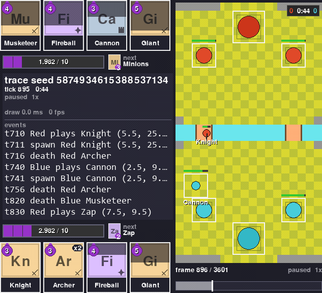

# RoyaleSim

<p align="center"><a href="https://github.com/RoyaleGym/RoyaleSim/actions/workflows/suite.yml"></a>   <a href="https://royalegym.github.io/RoyaleGym/"></a> <a href="https://discord.gg/4D2BS5JBHP"></a> </p>

<p align="center">  </p>

The Clash Royale battle engine your bot plays in. It runs the whole match on your own machine.
Most people use it through [RoyaleGym](https://github.com/RoyaleGym/RoyaleGym) and never call it directly.

<p align="center"></p>

## Install

```bash
pip install "royalegym[all]" --find-links https://github.com/RoyaleGym/RoyaleGym/releases/expanded_assets/v0.1.1
```

That installs this engine and everything else, on 3.12 or 3.13 (the engine alone runs on 3.10 and newer). [Install](https://royalegym.github.io/RoyaleGym/install/) has more.

## Try it

```python
import json, royalesim

b = royalesim.Battle(card_names=None, slot_of_k=[[0, 1, 2], [0, 1, 2]])
ids = {row[0]: i for i, row in enumerate(json.loads(b.catalogue_json()))}
deck = [ids[n] for n in ["Knight", "Archer", "Goblins", "Giant", "Musketeer", "Fireball", "Arrows", "Skeletons"]]
b.reset(seed=0, decks=[deck, deck], shuffle=1, start_tick=0, elixir_milli=[5000, 5000], tower_hp=None, spawns=[])
b.step([], 100)                                          # nobody can play in the opening seconds
r = b.step([(0, 0, 9000 * 18, 10000 * 18)], 20)         # blue plays its first card, then 20 ticks pass
print(json.loads(b.state_json())["tick"], royalesim.DEPLOY_REASONS[r[0][1]])   # 120 OK
```

## Next

- The engine's Python API: [API](https://royalegym.github.io/RoyaleGym/repos/royalesim/api/)
- How it works inside, how fast and how accurate it is, building from source: [Engine](https://royalegym.github.io/RoyaleGym/repos/royalesim/engine/)
- Questions: [Discord](https://discord.gg/4D2BS5JBHP)

MIT License.
